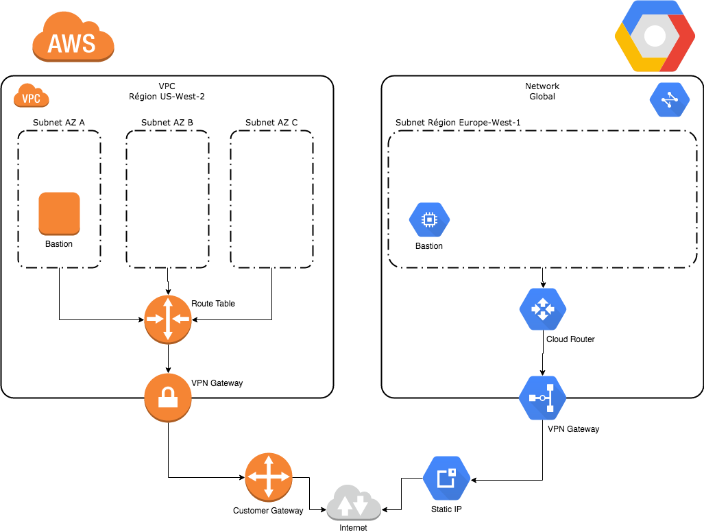

# E01 Construction d’une infrastructure multi-cloud

L'architecture cible est la suivante :



Les variables dans le fichier `variables.tf` peuvent être ajustées. Ensuite il suffit de lancer terraform pour construire l'infrastructure :
```shell
$ terraform init
$ terraform apply
```

Note : Une clé privée est demandée pour être déposée sur les bastions, celle par défaut est utilisée mais peut être changée facilement.
