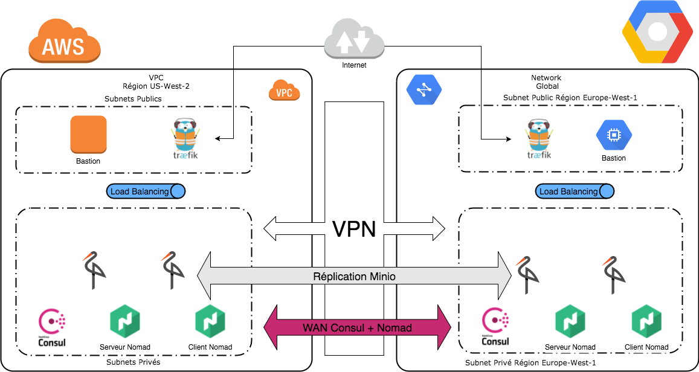

# E04 Stockage et réplication des données en mode multi-cloud

L'architecture cible est la suivante :



Les variables dans le fichier `variables.tf` peuvent être ajustées. Ensuite il suffit de lancer terraform pour construire l'infrastructure :
```shell
$ terraform init
$ terraform apply
```

Pour le déploiement des jobs Nomad depuis un des serveurs de l'infra :
```shell
export NOMAD_ADDR=http://nomad.service.consul:4646
nomad run minio-aws.nomad
nomad run minio-gcp.nomad
```
