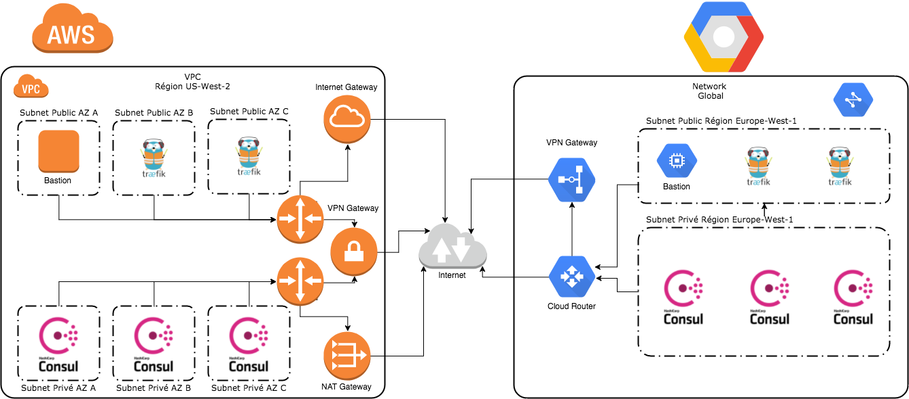

# E02 Construction d’une infrastructure multi-cloud

L'architecture cible est la suivante :



Les variables dans le fichier `variables.tf` peuvent être ajustées. Ensuite il suffit de lancer terraform pour construire l'infrastructure :
```shell
$ terraform init
$ terraform apply
```

Pour accéder aux interfaces d'administration, il est possible de rebondir via le bastion configuré à l'étape précédente :
```shell
# ssh -L 8080:IP_PRIVEE:8080 IP_PUBLIQUE_BASTION
ssh -L 8080:172.27.3.4:8080 35.195.115.253
```
